## 更新历史

| 日期       | 更新者 | 更新内容 | 版本号 |
| ---------- | ------ | -------- | ------ |
| 2018.10.19 | 郝睿   | 第一版本 | V1.0   |
| 2018.10.21 | 郝睿   | 添加原型 | V2.0   |

## 一、前言

### 1.1 引言

&ensp;&ensp;我们通常认为面对面的访谈是一种最具丰富内容的交流方法，同时是实践当中应用最为广泛的需求获取方法之一。同时，通过面谈可以获得很多的信息内容，其中包括：事实和问题，被会见者的观点，被会见者的感受，组织和个人的目标等信息。

### 1.2 目的

&ensp;&ensp;本文档旨在通过面对面的会见，从而获取“汉风堂”外卖订餐系统所需要的各类信息，从而可以细化解决方案中遇到的一些问题，在存在问题的方面与用户之间达成共识，确定该项目的解决方案。

### 1.3 阅读说明

&ensp;&ensp;本文档主要是以需求工程活动中的整个面谈过程为主要内容，叙述面谈过程中的面谈计划、面谈过程、面谈报告以及参考内容。其中内容主要以笔录、录音和电子文档等方式进行面谈过程的记录工作。

### 1.4 参考文献

&ensp;&ensp;[1]需求工程:软件建模与分析，骆斌、丁二玉，高等教育出版社，2009-04-01，ISBN：9787040262957 

## 二、面谈计划阶段

### 2.1 产生背景

&ensp;&ensp;“汉风堂”是南京大学仙林校区的一家校内餐厅，经营期间菜品深受学生们的欢迎，在校内树立了良好的品牌形象。但由于场地大小有限，进店消费人数较多，还常常有软件学院的学生留在餐厅内写大作业占用座位，该餐厅在营业时间内经常无法容纳下全部的顾客，顾客因为短时间内等不到位置而离开的现象时有发生。针对这一现象，该餐厅希望做一些外卖方面的尝试。但是由于营业环境在学校，周围没有更多的商家，因此无法将送餐服务转给大型外卖平台。餐厅总经理决定为该餐厅添加一套属于自己的外卖订餐系统，但是对于外卖服务的效果存在着一系列的担心，包括能否招募到送餐员工、送餐员工的可靠性和积极性、外卖菜品的销量以及餐厅员工对于订餐系统使用的上手难度和学习成本。老板希望新建立的外卖订餐系统能够消除他的这些担忧，确保有一套可靠的送餐员评估和激励机制，能够留下值得信赖的送餐员，及时处理掉不可靠的送餐员，提高送餐员的工作效率；建立菜品销量的查看机制，方便推陈出新，及时更新被选菜单；新系统简单易上手，能够提高“汉风堂”的销量及知名度，获得更多的好评和经济效益。

### 2.2 面谈目的

* 第一次面谈：
  1. 初步了解餐厅外卖服务的业务流程
  2. 了解餐厅的运营状况及规模
  3. 了解餐厅对于外卖服务的担忧
  4. 了解客户的一些希望和目标
* 第二次面谈：
  1. 对上一次面谈中不明确的地方和遗漏掉的地方进行确认
  2. 了解和各类用户相关的细节问题
  3. 明确数据要求
* 第三次面谈：
  1. 向甲方展示用户界面的水平原型
  2. 对上一次面谈后新增的一些问题进行确认

### 2.3 面谈对象

&ensp;&ensp;客户：杨修远  吴文韬  肖宇豪

### 2.4 面谈类型和面谈结构

&ensp;&ensp;本次面谈采用半结构化面谈的方式，事先准备好了面谈的问题和结构，但在实际面谈过程中进行了调整和补充。

&ensp;&ensp;本次面谈使用的问题有以下两种：

* 开放式问题（Open-Ended）
* 封闭式问题（Closed）

&ensp;&ensp;本次面谈中使用的原型技术有：

* 人机交互的水平原型

### 2.5 面谈问题

* 第一次面谈：

  1. 能否描述一下理想的外卖服务流程？
  2. 所有员工具体指？
  3. 总菜单和店内菜单一样吗？
  4. 菜品过多具体会造成什么影响？
  5. 店内订单数量不理想的原因？
  6. 对新系统有哪些期望？
  7. 你们在这个系统中重点强调哪些问题？
  8. 你们觉得有哪些问题或者需求是必须要考虑的要点？
  9. 这个平台大概可以抽象成3个，顾客平台、送餐员平台、管理员（+接单员）平台，是么？
  10. 您觉得平台需要考虑送餐员的薪水问题吗
  11. 平台需要为信息对称做校园的学生信息对接吗
  12. 平台需要考虑违约问题吗
  13. 你们提出提高效率指的更具体地是指？
  14. 你们觉得在未来还有什么需要改进的呢？

* 第二次面谈：​		
  * 针对业务：
    1. 要做的系统是手机APP吗，需不需要提供网页版的支持？     
    2. 部署该系统后，会不会出现点外卖的人多了，店内就餐人数反而变少了，总顾客并没有增加的现象？2.1 如果是，是否做好了心理准备和应对措施？
    3. 系统需要支持将每天接受的订单情况导出打印记账吗？
    4. 一些不适合外送的菜品，比如汤、面等，如何解决？

  * 针对顾客：
    1. 系统仅针对校内学生吗？之后是否会提供服务给周边居民，比如和园。
    2. 关于提到的备菜冗余，是否可能存在备菜不足的情况，导致有些菜品无法提供给顾客？
    3. 顾客如果取消订单该如何处理？
  * 针对送餐员：
    1. 具体的送餐员激励机制是怎样的？
    2. 提醒送餐员取餐的具体方式是什么？
    3. 如何核实送餐员是否真的违约？
  * 针对收银员：
    1. 收银员处理投诉问题是否不属于系统的作用域？
  * 针对总经理：
    1. 总经理是否使用过其他员工管理系统、对待新系统态度如何？
    2. 描述一下总经理在系统中的具体职责。除了 查看菜单、管理菜单、管理送餐员，是否还有其他？
    3. 查看菜单时，是否需要支持查看单个菜品的销量变化？
  * 针对数据：
    1. 描述一下理想中发布了的菜品显示哪些数据？
    2. 理想中已注册送餐员需要显示哪些数据？
    3. 对于顾客和经理来讲，送餐员各种数据的可见性是否应该存在区别？
    4. 关于菜品销量排行、送餐员效率排行，是全部显示出还是只显示前十位+自身？

* 第三次面谈：

  * 展示界面原型

  * 补充问题：

  * 1. 顾客提交订单后就支付还是顾客确认送达后再点击支付？

    2. 如果没有送餐员接单怎么办？

    3. 促销策略只有满减促销？

    4. 菜品数据统计除了统计销量还需要统计什么?

    5. 系统需要导出的订单数据的格式？

    6. 经理不需要查看送餐员的业绩与排名之类的信息吗？

    7. 送餐员奖励机制需要根据哪些数据来确定奖励？

## 三、面谈具体过程

### 3.1 面谈参与人员

&ensp;&ensp;项目组参与人员：

* 林宇超  职位：项目成员 （第一次面谈）

* 郝睿  职位：项目成员  （第二、三次面谈）
* 钱美缘  职位：项目成员  （第二次面谈）
* 恽叶霄  职位：项目经理  （第三次面谈）

&ensp;&ensp;客户方参与人员：

* 杨修远
* 吴文韬
* 肖宇豪

### 3.2 面谈时间

* 第一次面谈：2018年10月4日
* 第二次面谈：2018年10月18日
* 第三次面谈：2018年10月21日

### 3.3 面谈地点

&ensp;&ensp;珠江路麦当劳餐厅

&ensp;&ensp;费彝民楼7楼沙发

### 3.4 面谈项目

&ensp;&ensp;“汉风堂”外卖订餐系统

### 3.5 面谈目的

- 第一次面谈：
  1. 初步了解餐厅外卖服务的业务流程
  2. 了解餐厅的运营状况及规模
  3. 了解餐厅对于外卖服务的担忧
  4. 了解客户的一些希望和目标
- 第二次面谈：
  1. 对上一次面谈中不明确的地方和遗漏掉的地方进行确认
  2. 了解和各类用户相关的细节问题
  3. 明确数据要求 
- 第三次面谈：
  1. 确认界面原型是否符合甲方要求
  2. 对上次面谈后新增问题予以确认

### 3.6 面谈方式

&ensp;&ensp;通过面对面的会见方式，同时通过笔录和录音来进行面谈内容记录。

### 3.7 面谈内容

* 第一次面谈：

1. 能否描述一下理想的外卖服务流程？

   答：顾客点单，收银员接单报至后厨，后厨做好后打包留待送餐员取餐送给顾客。

2. 所有员工具体指？

   答：送餐员、总经理、客服收银员。

3. 总菜单仅是指这个系统里的菜单？

   答：是，这是汉风堂自用的系统。

4. 菜品过多具体会造成什么影响？

   答：销量低的菜品会造成备菜冗余。

5. 店内订单数量不理想的原因？

   答：不能提供外卖服务；线下不方便及时获取消费者的反馈评价；宣传不够。

6. 对新系统有哪些期望？

   答：能解决问题；简单易用；能提供菜品销量查看；能提高利润。

7. 你们在这个系统中重点强调哪些问题？

   答：问题重要性：4>1>2>3（这里指的是甲方提出的问题）

   1. 店内希望能雇佣到靠谱可信赖的送餐员工。
   2. 希望所有员工（包括送餐员）可以尽快上手该系统，同时系统有其他提高所有员工（包括送餐员）工作效率的机制。
   3. 店内菜品过多，商家希望秉承优胜劣汰的原则，不断更新总菜单。
   4. 希望能够进一步提高店内订单的数量，吸引更多的消费者。

8. 你们觉得有哪些问题或者需求是必须要考虑的要点？

   答：这个平台是最重要的，也就是说上面的所有问题是建立在这个平台之上的，能现有这个平台，再去考虑优化机制。

9. 这个平台大概可以抽象成3个，顾客平台、送餐员平台、管理员（+接单员）平台，是么？

   答：是的。

10. 您觉得平台需要考虑送餐员的薪水问题吗

    答：需要，也就是平台其实有两个资金流动，一个是顾客到商家的资金流动，另一个是平台给送餐员的工资。

11. 平台需要为信息对称做校园的学生信息对接吗

    答：需要，这样才能保障学生的信息符合平台要求。

12. 平台需要考虑违约问题吗

    答：需要，但只需要（顾客）将违约问题反馈给接单员，由管理员（总经理）手动在管理平台操作指定哪些送餐员违约。

13. 你们提出提高效率指的更具体地是指？

    答：送餐员。

14. 你们觉得在未来还有什么需要改进的呢？

    答：系统能够完成之后再考虑。

15. 你们觉得问题有什么要添加或减少的呢？

    答：app要能够容易上手，就是交互上的，并能够引导用户。

* 第二次面谈：

1. 要做的系统是手机APP吗，需不需要提供网页版的支持？     

   答：经理需要网页能查看一些数据的统计，顾客和送餐员都只需要手机APP。

2. 部署该系统后，会不会出现点外卖的人多了，店内就餐人数反而变少了，总顾客并没有增加的现象？  

   答：有这种可能。

   2.1 是否做好了心理准备和应对措施？

​        答：后期可以根据营业情况做出调整，搞一些仅限实际进店消费才可参加的活动。

3. 系统需要支持将每天接受的订单情况导出打印记账吗？

   答：需要。

4. 一些不适合外送的菜品，比如汤、面等，如何解决？

   答：可以不送，仅在店内销售。

5. 系统仅针对校内学生吗？之后是否会提供服务给周边居民，比如和园。
   答：假定全在南大校内。

6. 关于提到的备菜冗余，是否可能存在备菜不足的情况，导致有些菜品无法提供给顾客？
   答：有可能，显示已经售完就行。

7. 顾客如果取消订单该如何处理？
   答：做好的菜品直接扔掉，退钱给顾客。但是有次数限制，这个限制由乙方来决定。

8. 针对送餐员，具体的激励机制是怎样的？
   答：根据送餐的数量、工作效率来进行工资、福利方面的奖励。具体内容由乙方决定，甲方负责审核。

9. 提醒送餐员取餐的具体方式是什么？
   答：APP内显示当前店内有可送的订单，送餐员抢订单。

10. 送餐员的报酬是否通过系统转账，支持提现？

    答：每一单提成、报酬由系统计算出具体数字。仍旧采用传统的打卡进账式结算。

11. 工资是周结还是月结？

    答：月结。

12. 如果送餐员被投诉违约，如何核实？

    答：由餐厅收银员打电话和顾客联系，不属于系统需要处理的范围。

13. 描述一下理想的违约处理办法？

    答：由总经理自行决定。

14. 上述回答是否意味着收银员不再处理投诉，而是将投诉反映在对送餐员的评价上？

    答：是的，投诉由系统外解决。系统只需提供顾客收单后对送餐员的评分系统，支持标签式评价。

15. 总经理是否使用过其他员工管理系统？

    答：使用过。

16. 总经理对新系统态度如何？

    答：当然是强烈支持。

17. 描述一下总经理在系统中的具体职责，除了查看菜单、管理菜单、管理送餐员，是否还有其他？
    答：制定满减策略。

18. 总经理查看菜单时，是否需要支持查看单个菜品的销量变化？
    答：需要。

19. 理想中发布了的菜品需要显示哪些数据？

    答：名称、图片、文字介绍、单价、销售量。

20. 理想中已注册送餐员的数据格式。

    答：编号、名称、联系电话、住址、入职时间、学号。

21. 关于上述送餐员的基本数据，是否还需要添加顾客的评分统计、月送餐量等选项？
    答：需要。

22. 对于顾客和经理来讲，送餐员各种数据的可见性是否应该存在区别？
    答：顾客：名字、联系方式、位置；总经理：当月应支付的报酬。

23. 关于菜品销量排行、送餐员效率排行，是全部显示出还是只显示前十位+自身？
    答：全部。

* 第三次面谈：

1. 关于顾客对送餐员的贴标签评价，能否具体描述一下？

   答：不需要贴标签了，直接反应在评价内容里面就行。

2. 顾客提交订单后就支付还是顾客确认送达后再点击支付？

   答：提交订单后就支付。

3. 如果没有送餐员接单怎么办？

   答：设定一个时限，超过时限后系统取消订单，退钱给顾客。

4. 促销策略只有满减促销？

   答：满减、特价。由总经理设置。

5. 菜品数据统计除了统计销量还需要统计什么?

   答：评分。

6. 系统需要导出的订单数据的格式？

   答：详细信息全部导出。要求支持单条导出和批量导出。导出时能查看销售额、销售量。

7. 经理不需要查看送餐员的业绩与排名之类的信息吗？

   答：需要，并且送餐员自己和总经理都还需要看到应结报酬。

8. 送餐员奖励机制需要根据哪些数据来确定奖励？

   答：排行榜和激励机制根据顾客对送餐员的评分、运送平均时长来考虑。也可以乙方自己再添加点什么。

## 四、面谈报告概要

| 会见者：林宇超                                               | 日期：2018年10月4日                                          |
| :----------------------------------------------------------- | :----------------------------------------------------------- |
| 被会见者：杨修远                                             | 主题：关于“汉风堂”外卖服务面临问题的初步了解                 |
| 会见目标： 初步了解餐厅外卖服务的业务流程 了解餐厅的运营状况及规模 了解餐厅对于外卖服务的担忧 了解客户的一些希望和目标 |                                                              |
| 谈话要点： 简要说明餐厅外卖服务的业务流程 对于外卖服务的担忧 对未来发展的希望和一些措施 对新系统的一些看法和期望 | 被会见者的观点： 顾客点单，收银员接单报至后厨，后厨做好后打包留待送餐员取餐送给顾客 招不到高质量送餐员；收银员太忙 迫切需要一个高效易用的外卖订餐系统 能解决问题，简单易用，能提供菜品销量查看，提高利润 |
| 下次会见的目标： 对此次面谈中不明确的部分进一步面谈和了解 对提出的解决方案进行协商评估 找出下一个被会见者的观点 |                                                              |

| 会见者：郝睿、钱美缘                                         | 日期：2018年10月18日                                         |
| :----------------------------------------------------------- | :----------------------------------------------------------- |
| 被会见者：杨修远、吴文韬                                     | 主题：关于“汉风堂”外卖订餐系统用户需求的初步了解             |
| 会见目标: 对上一次面谈中不明确的地方和遗漏掉的地方进行确认 了解和各类用户相关的细节问题 明确数据要求 |                                                              |
| 谈话要点： 如何应对进店消费人数的减少 如何应对已经做好菜品后顾客取消订单 激励送餐员一些措施 一些数据上的格式要求 | 被会见者的观点： 搞特有的线下活动吸引顾客进店消费 暂定丢弃菜品，退钱给顾客；实际解决方案留待讨论 工资、福利等，具体由乙方设计 详见面谈内容 |

| 会见者：恽叶霄、郝睿                                         | 日期：2018年10月21日                               |
| ------------------------------------------------------------ | -------------------------------------------------- |
| 被会见者：吴文韬、肖宇豪                                     | 主题：关于“汉风堂”外卖订餐系统界面原型的展示       |
| 会见目标： 向甲方展示人机交互的水平原型 对第二次面谈中遗漏的问题加以补充 |                                                    |
| 谈话要点： 原型展示和解释说明                             | 被会见者的观点： 总体上认可了我们提供的界面原型 |

## 五、使用的界面原型

### 5.1 顾客订餐

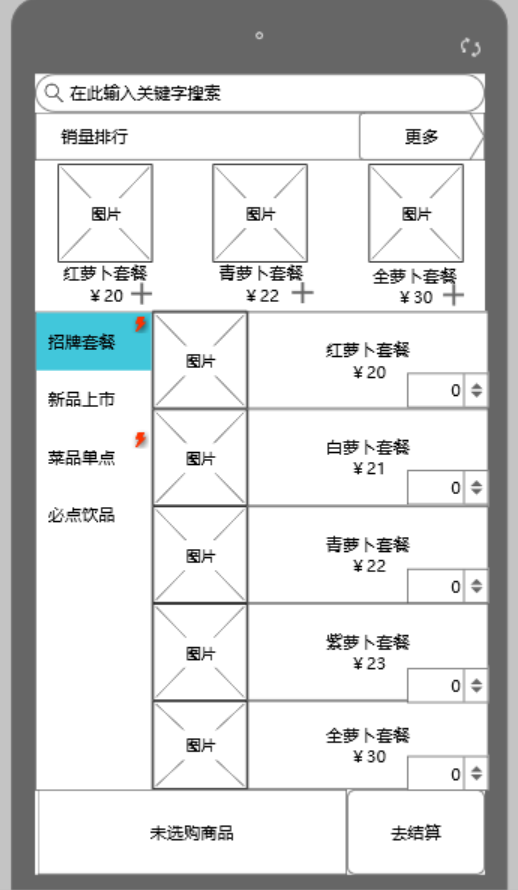

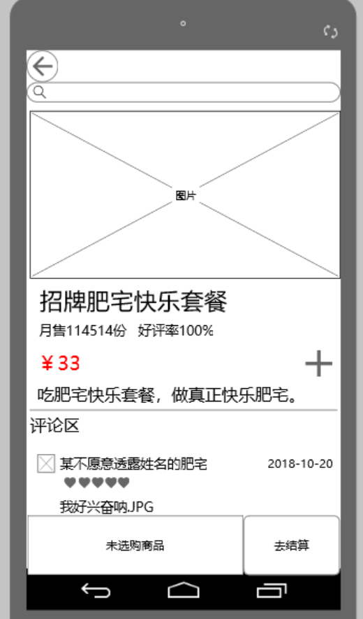

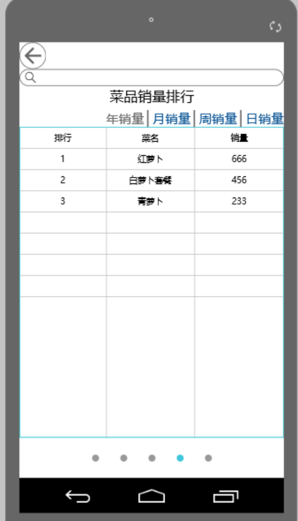

### 5.2 总经理管理

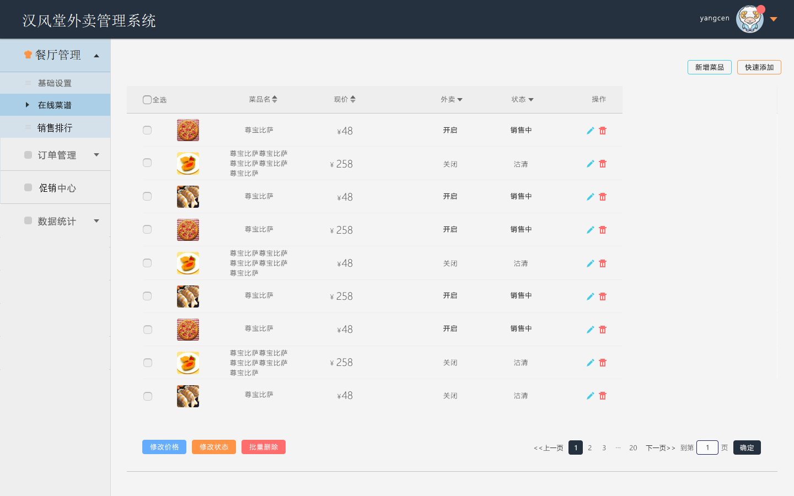

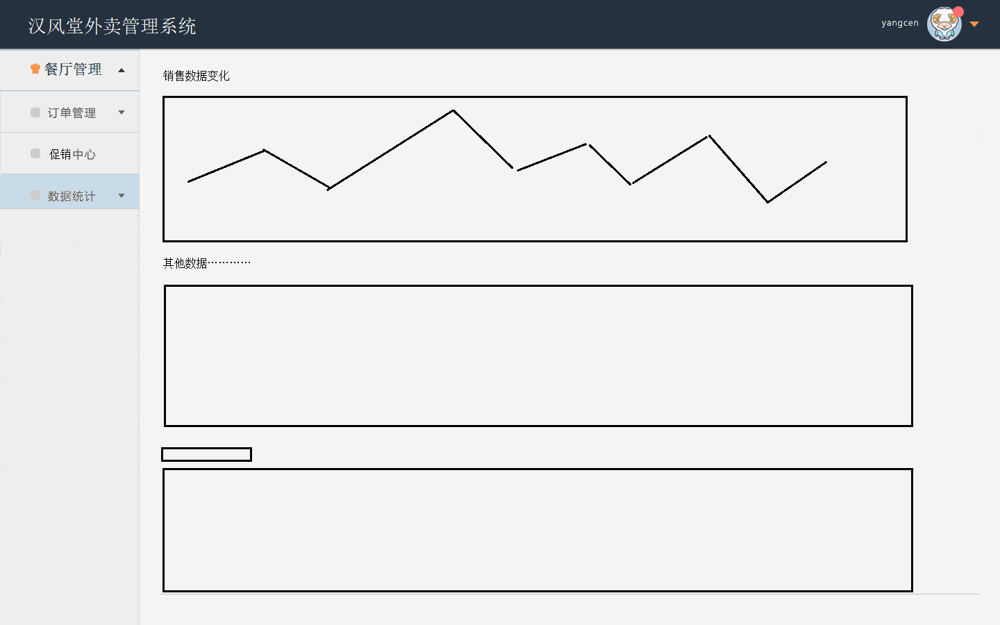

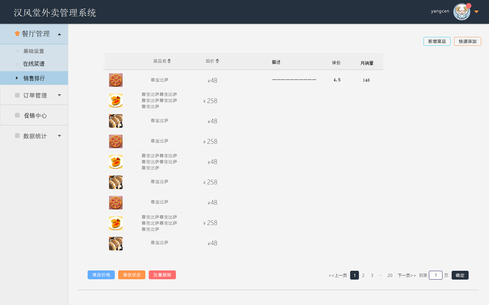

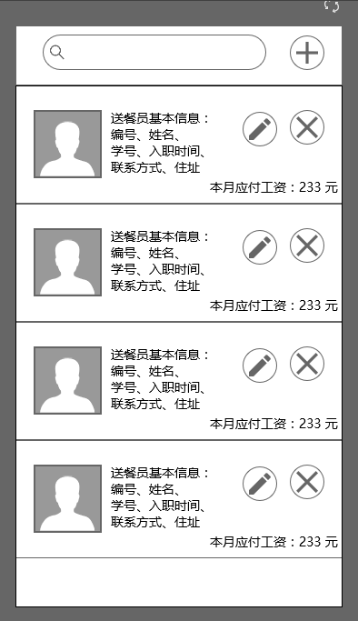

### 5.3 送餐员平台

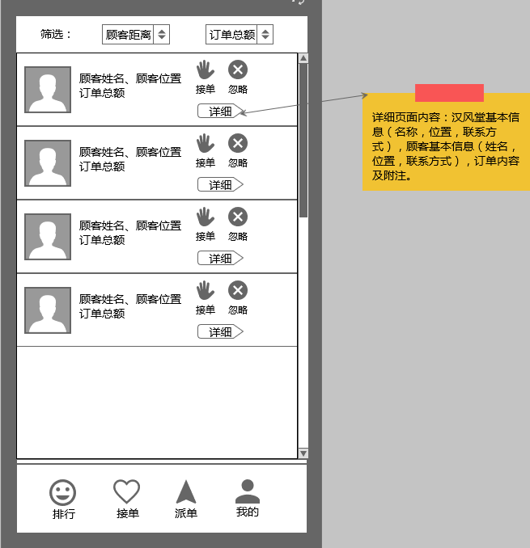

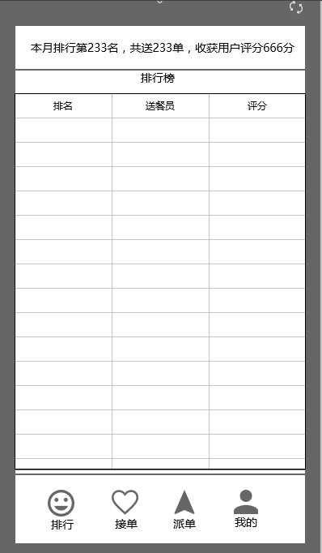

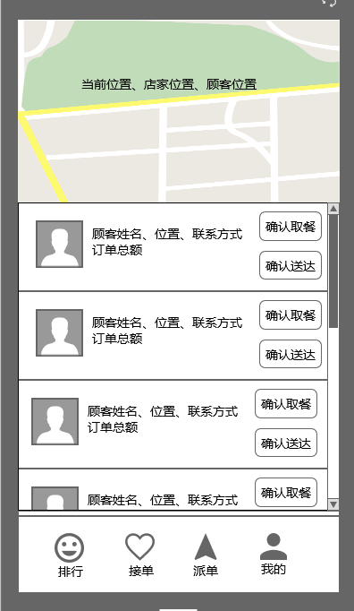

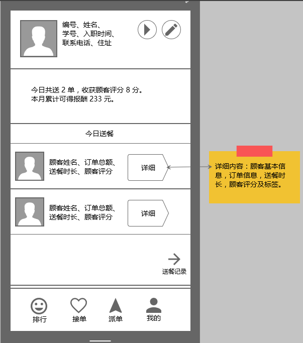

### 5.4 招聘平台

