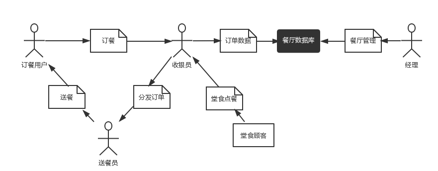
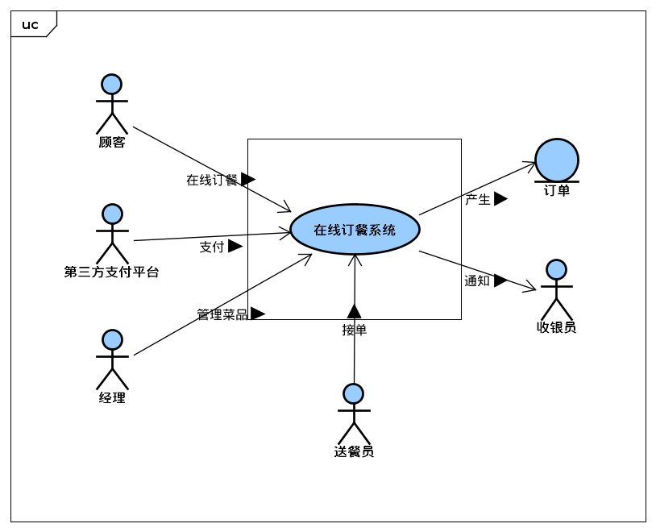
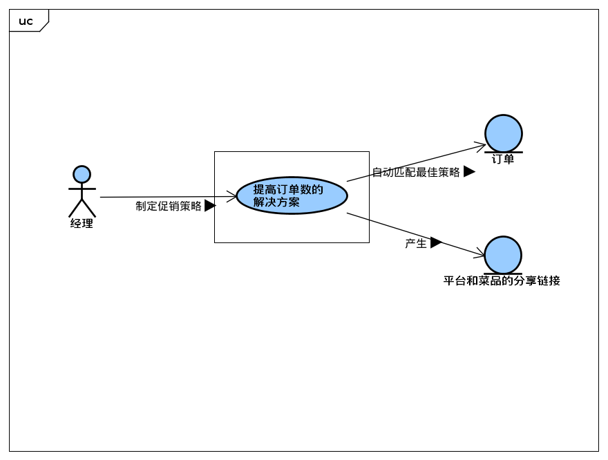
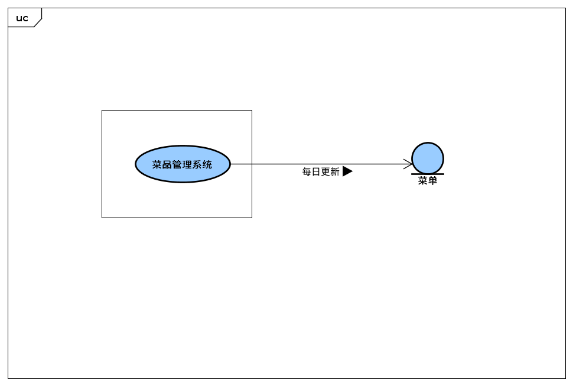
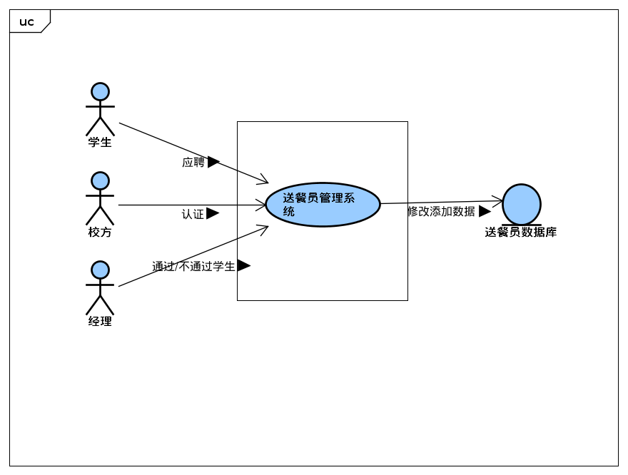
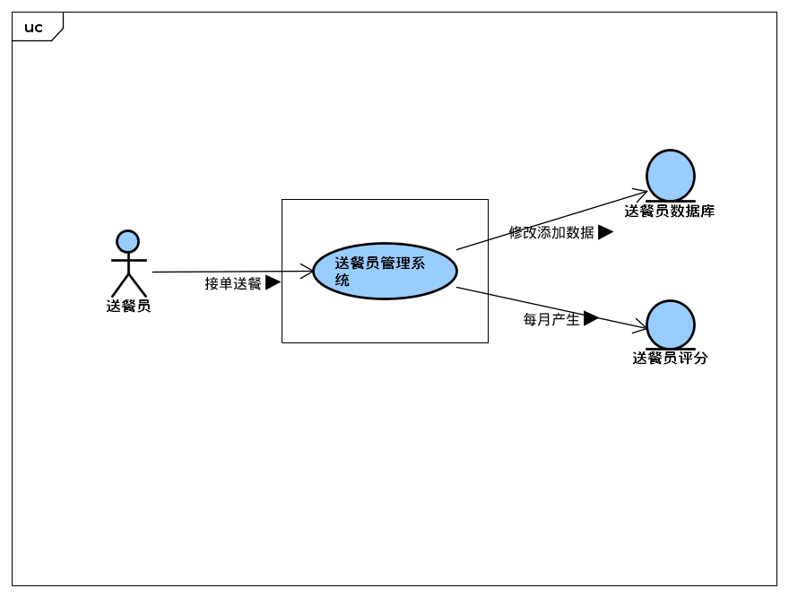
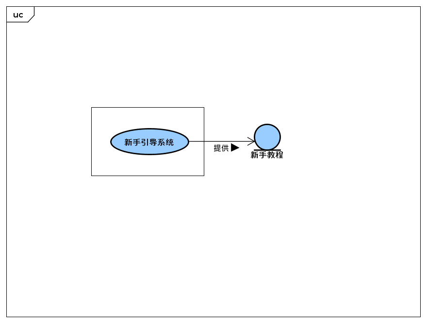
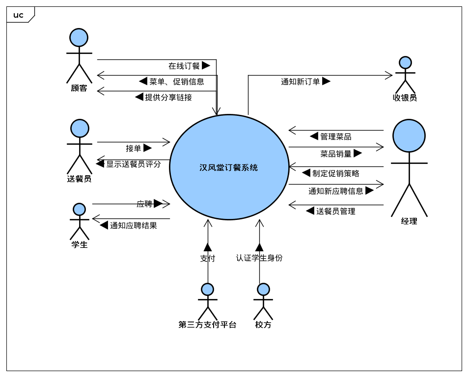
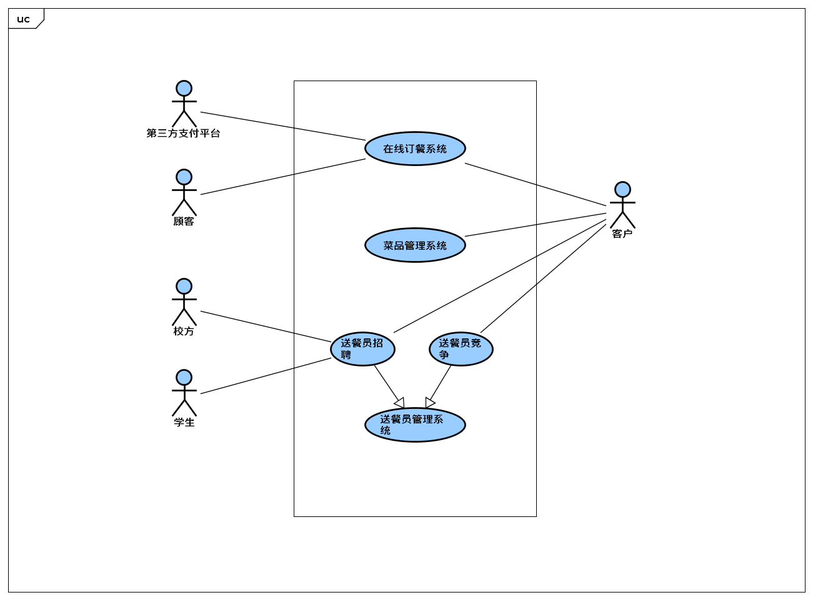

汉风堂订餐系统问题分析过程
===

南京大学软件学院16级本科  
2018年10月1日
---

## 团队
> 161250192 恽叶霄  
> 161250102 钱美缘  
> 161250037 郝睿  
> 161250070 林宇超  

## 明确问题  
### 1.1 初步了解问题  
&ensp;&ensp;“汉风堂”是南京大学仙林校区的一家校内餐厅，经营几年，生意火爆，常常出现店面无法容纳下所有顾客的现象，因此餐厅希望推出外卖订餐服务，新建一个方便快捷的外卖订餐系统。服务推出后，预计系统使用者有店内职工：包括经理和接单服务员、外包性质的学生送餐员以及订餐顾客。由于餐厅营业环境在学校，周围没有更多的商家，因此无法将送餐服务转给大型外卖平台，因此招募的送餐员都是兼职的学生，缺乏送餐经验，业务能力得不到保证，可能会招致顾客及餐厅双方面的不满。另外，收银员本来只需要负责将堂食顾客的订单报至后厨和收银，在外卖服务推出后还需要同时将外卖订餐系统中接到的订单及时的传递给后厨，如果消息传递的不及时，，可能会降低顾客的满意度。由于餐厅提供的菜品较多，餐厅总经理苦于无法高效的统计菜品销量排行，做到及时的推陈出新。综上所述，餐厅希望新建立的外卖订餐系统可以解决这些问题，改善餐厅的经营和管理。  
&ensp;&ensp;我们小组通过开会讨论，从中提取出了几个客户希望表达的问题和我们开发人员的疑问并记录下来，然后与客户进行了第一次面谈，面谈报告如下：  

|会见者：林宇超|日期：2010年10月4日|
|:---|:---|
|被会见者：|主题：关于“汉风堂”外卖服务面临问题的初步了解|
|会见目标 初步了解餐厅外卖服务的业务流程 了解餐厅的运营状况及规模 了解餐厅对于外卖服务的担忧 了解客户的一些希望和目标|
|谈话要点： 简要说明餐厅外卖服务的业务流程 对于外卖服务的担忧 对未来发展的希望和一些措施 对新系统的一些看法和期望|被会见者的观点： 顾客点单，收银员接单报至后厨，后厨做好后打包留待送餐员取餐送给顾客 招不到高质量送餐员；收银员太忙 迫切需要一个高效易用的外卖订餐系统 能解决问题，简单易用，能提供菜品销量查看，提高利润|	
|下次会见的目标： 对此次面谈中不明确的部分进一步面谈和了解 对提出的解决方案进行协商评估 找出下一个被会见者的观点|

通过这次面谈，我们了解到该店的一些情况：  
**目前状况**  
1. 该店店面较小，容纳不了所有顾客同时就餐；  
2. 该店暂时没有推出外卖订餐服务；  
3. 该店职员有总经理1人，收银员和厨师若干；希望在外卖服务推出后将送餐外包给兼职学生  
4. 期望的外卖服务流程：顾客通过系统付钱订餐--->收银员接单并通知后厨--->后厨出菜打包--->送餐员取餐送餐--->顾客取餐消费并进行评价；  
5. 菜单菜品较多，没有统计菜品销量  

**客户希望实现的功能**  
1. 顾客便捷下单  
2. 收银员接单清楚明确  
3. 有顾客对菜品的评价功能  
4. 有顾客对送餐员的评价功能  
5. 能够查看菜品的销量排行  
6. 能够通过系统招募到可靠的送餐员 
7. 能够及时提醒送餐员送餐  

**总的概述**  
当前，该餐厅并没有推出过外卖订餐服务，主要的担忧在于推出该项服务之后的员工效率问题，以及餐厅的口碑是否会受到负面影响。  
### 1.2 问题达成共识
&ensp;&ensp;面谈之后，我们提炼了五个主要的高层次问题，采用如下标准化的格式进行描述，并在涉众之间取得了认同。  

|**要素**|**内容**|
|:---|:---|
|**ID**|P1|
|**提出者**|总经理|
|**关联者**|总经理、顾客|
|**问题**|餐厅较小，无法容纳所有顾客|
|**影响**|餐厅利润无法进一步提高；顾客满意度下降；餐厅树立的良好口碑得到损害|

|**要素**|**内容**|
|:---|:---|
|**ID**|P2|
|**提出者**|总经理|
|**关联者**|总经理、顾客|
|**问题**|餐厅离外包外卖商较远|
|**影响**|无法将送餐服务转给大型外卖平台|

|**要素**|**内容**|
|---|---|
|**ID**|P3|
|**提出者**|总经理|
|**关联者**|总经理|
|**问题**|希望进一步提高订单数|
|**影响**|餐厅营业额无法上升|

|**要素**|**内容**|
|---|---|
|**ID**|P4|
|**提出者**|总经理|
|**关联者**|总经理|
|**问题**|销量低的菜品造成备菜冗余|
|**影响**|餐厅成本得不到降低，利润得不到提高；造成不必要的资源浪费|

|**要素**|**内容**|
|---|---|
|**ID**|P5|
|**提出者**|总经理|
|**关联者**|总经理、送餐员、顾客|
|**问题**|担心招不到高质量的学生送餐员|
|**影响**|影响外卖服务的开展；降低餐厅的外卖订单数；降低顾客订餐体验|

|**要素**|**内容**|
|---|---|
|**ID**|P6|
|**提出者**|总经理|
|**关联者**|总经理、送餐员、顾客|
|**问题**|希望能够保持送餐员的送餐效率以及积极性|
|**影响**|餐厅营业额无法上升；影响顾客满意程度|

|**要素**|**内容**|
|---|---|
|**ID**|P7|
|**提出者**|收银员|
|**关联者**|收银员、顾客|
|**问题**|担心新系统影响工作效率|
|**影响**|无法兼顾堂食订单和外卖订单；降低顾客消费体验|

**收集背景资料，判断问题的明确性**  
&ensp;&ensp;我们通过收集有关“汉风堂”餐厅和外卖订餐服务相关的背景资料，结合客户提出的问题，分析和理解问题域，对上述7个问题的明确性做了初步判断，认为上述问题都属于是明确一致的问题。  

## 2 涉众分析
### 2.1 涉众识别
通过任务发现涉众并过滤非关键涉众后，我们识别出了初始涉众类别并建立了如下的交互网络草图：  

### 2.2 涉众描述
涉众的基本特征描述：  

|涉众|特征|
|:---|:---|
|订餐顾客|绝大多数的订餐顾客是南京大学校内的学生或者教职工，顾客使用系统是为了避免去狭小的汉风堂餐厅内部就餐，同时也为了节约用餐时间。顾客在营业时间使用系统完成订单，之后等待系统通知从送餐员处取得自己的外卖。|
|送餐员|送餐员是南京大学仙林校区的学生，通过了招募和审核，属于外包性质，不属于汉风堂的员工。送餐员使用系统获取外卖订单，并从收银员处取得菜品，按时送给订餐顾客。|
|收银员|收银员将使用系统将订单报送后厨，并将后厨做好的菜品转交给送餐员。收银员是汉风堂的员工，由于同时负责堂食收银，因此使用系统应当尽可能地便捷。|
|经理|经理使用系统查看餐厅外卖的基本销售情况和财务数据，可以对外卖系统的菜单手动作出调整。经理可以在任何时候访问到系统的数据。|

涉众的扩展特征描述：  

|涉众|主要目标|态度|主要关注点|约束条件|
|:---|:---|:---|:---|:---|
|订餐顾客|节约时间，避免在餐厅排队|积极支持外卖系统，认为应当尽早上线|使用简单，送餐速度快，菜品选择丰富|需要通过网络访问系统|
|送餐员|帮助餐厅送餐，以取得报酬|愿意通过外卖系统送餐，但是会担心得到的报酬不够|送餐方便，每天均能保证一定的收入|可能没有足够的空闲时间送餐|
|收银员|方便地完成订单和外卖的转交|担心影响到平时的收银业务，否则很愿意接受该系统|保证不影响正常工作|无|
|经理|增加餐厅销售额，菜单能自动更新|强烈要求尽快完成订单系统|关注送餐所需的费用和系统的安全性|需要使用网络访问系统，很少有时间细致地管理系统|

### 2.3 涉众评估
建立User/Task表格，通过对表格内容的分析和比较来评估涉众的优先级：  

|用户群体|任务|群体数量|优先级|
|:---|:---|:---|:---|
|订餐顾客|下单订餐| \>200 |3|
|送餐员|送餐|10|3|
|收银员|转交订单|2|2|
|经理|餐厅管理|1|1|

## 3. 发现业务需求  
&ensp;&ensp;确定每一个问题对应的目标的过程就是发现业务需求的过程。因此，针对上述七个高层次问题，我们确定了对应的业务需求。将问题描述表扩展成以下的问题及业务需求描述表：  

|**要素**|**内容**|
|:---|:---|
|**ID**|P1|
|**提出者**|总经理|
|**关联者**|总经理、顾客|
|**问题**|餐厅较小，无法容纳所有顾客|
|**影响**|餐厅利润无法进一步提高；顾客满意度下降；餐厅树立的良好口碑得到损害|
|**目标**|BR1:使用系统1个月后，一天的实际顾客数提高15% BR2:使用系统3个月后，订单数量提高30% BR3:使用系统3个月后，一天的营业利润提高30%|

|**要素**|**内容**|
|:---|:---|
|**ID**|P2|
|**提出者**|总经理|
|**关联者**|总经理、顾客|
|**问题**|餐厅离外包外卖商较远|
|**影响**|无法将送餐服务转给大型外卖平台|
|**目标**|BR0:建立自己的外卖订餐系统|

|**要素**|**内容**|
|---|---|
|**ID**|P3|
|**提出者**|总经理|
|**关联者**|总经理|
|**问题**|希望进一步提高订单数|
|**影响**|餐厅营业额无法上升|
|**目标**|BR2:使用系统1个月后，订单数量提高30%|

|**要素**|**内容**|
|---|---|
|**ID**|P4|
|**提出者**|总经理|
|**关联者**|总经理|
|**问题**|销量低的菜品造成备菜冗余|
|**影响**|餐厅成本得不到降低，利润得不到提高；造成不必要的资源浪费|
|**目标**|BR2:使用系统1个月后，订单数量提高30% BR4:使用系统后可以查看菜品的销量排行|

|**要素**|**内容**|
|---|---|
|**ID**|P5|
|**提出者**|总经理|
|**关联者**|总经理、送餐员、顾客|
|**问题**|担心招不到高质量的学生送餐员|
|**影响**|影响外卖服务的开展；降低餐厅的外卖订单数；降低顾客订餐体验|
|**目标**|BR5:使用系统3个月后，能够招到同等时间能力达到专业送餐员送餐数一半的学生送餐员|

|**要素**|**内容**|
|---|---|
|**ID**|P6|
|**提出者**|总经理|
|**关联者**|总经理、送餐员、顾客|
|**问题**|希望能够保持送餐员的送餐效率以及积极性|
|**影响**|餐厅营业额无法上升；影响顾客满意程度|
|**目标**|BR1:使用系统1个月后，一天的实际顾客数提高15% BR2:使用系统1个月后，订单数量提高30% BR3:使用系统3个月后，一天的营业利润提高30% BR6:使用系统3个月之后，学生送餐员的订单数并没有明显下降|

|**要素**|**内容**|
|---|---|
|**ID**|P7|
|**提出者**|收银员|
|**关联者**|收银员、顾客|
|**问题**|担心新系统影响工作效率|
|**影响**|无法兼顾堂食订单和外卖订单；降低顾客消费体验|
|**目标**|BR7:使用系统1个月后，出错率维持在一个较低水平|

## 4. 定义解决方案与系统特性

### 4.2 确定系统特性和解决方案的边界

&ensp;&ensp;在选定解决方案之后，我们进一步分析并确定出这些解决方案所需具备的系统特性。  

|**针对的问题**|**解决方案所需的系统特性**|
|---|---|
|P1|SF1: 系统提供菜单中菜品的增删改查等管理功能 SF2: 系统支持第三方平台支付、转账 SF3: 系统记录订单的建立、生效、接单、结束 SF4: 记录送餐员的订单以及个人信息|
|P2|SF5: 系统提供向第三方平台的平台和菜品分享功能 SF6: 系统允许总经理制定促销策略|
|P3|SF7: 系统定时根据菜品的销量和反馈更新菜单|
|P4|SF8: 系统能够对接校园身份信息并进行处理 SF9: 系统允许总经理通过或拒绝一个学生的应聘|
|P5|SF10: 系统记录送餐员每次送餐的相关数据 SF11: 系统建立送餐员评价体制|
|P6|SF12: 系统具有新手导航功能|

&ensp;&ensp;接着，我们根据已经确定下来的系统特性，分析系统与周围环境及涉众的交互作用，定义解决方案的边界，并同时确定了信息流的输入输出关系：  

SF1~SF4的用例图  

SF5~SF6的用例图  

SF7的用例图  

SF8~SF9的用例图  

SF10~SF11的用例图  

SF12的用例图  

### 4.4 确定系统边界
&ensp;&ensp;通过整合所有问题的解决方案，我们确定了整个系统的功能和边界。我们绘制了汉风唐订餐系统的上下文图，在图中，我们列出了所有与该系统交互的外部实体，描述了这些外部实体与本系统交互中涉及到的数据流，包括了系统输入和系统输出。  

&ensp;&ensp;最后我们将所有与客户达成一致意见的解决方案所对应的用例整合起来，建立了一张汉风唐订餐系统的系统用例图，展示系统特性和行为特性。  

